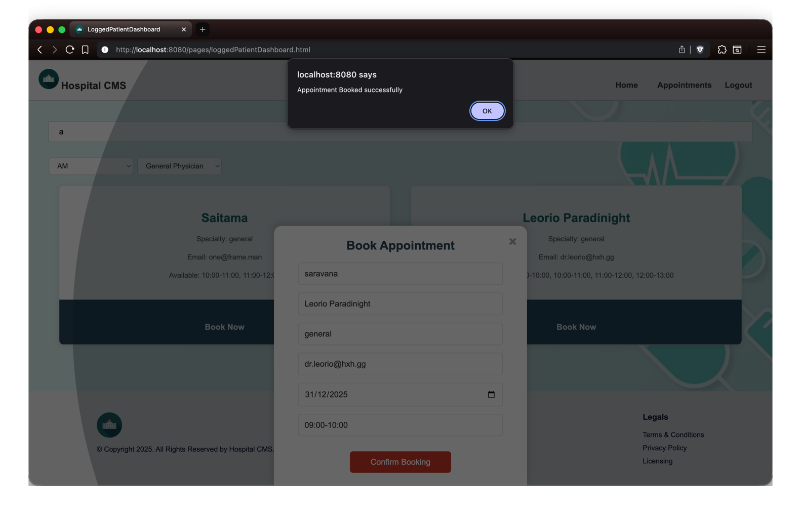

# 🏥 Clinic Management System
A robust, enterprise-grade Java backend application designed to streamline clinic operations, patient onboarding, and appointment scheduling.

## 🚀 Overview
This project is a full-stack web application built using **Java, Spring Boot, MySQl and MongoDB**. It manages the core lifecycle of a healthcare clinic—from patient registration and doctor availability to booking appointments and managing records.

The system is designed with **clean architecture** and **data integrity** in mind, ensuring that medical records are handled securely and efficiently.

## 🛠️ Tech Stack
* **Backend:** Java 17+, Spring Boot, Spring Data JPA
* **Database:** Oracle SQL / MySQL (Persistence Layer), MongoDB
* **Frontend:** HTML5, CSS3, JavaScript, Thymeleaf (Server-side rendering)
* **Build Tool:** Maven

## ✨ Key Features
* **Patient Management:** Full CRUD operations for patient profiles and medical history.
* **Doctor Directory:** Advanced filtering for doctors based on specialization and availability.
* **Appointment Booking:** Intelligent scheduling system with real-time status updates (Pending, Approved, Completed).
* **Secure Persistence:** Relational database design optimized for high-concurrency environments.
* **Stored Procedures:** Stored procedures for viewing statistical data.

## 📸 Screenshots
The following images demonstrate the system's core interface and workflow.
*(Images located in: `app/src/main/resources/static/outputs/ss/`)*

### 1. Admin adding a doctor

*Admins can search doctors by filters, add a new doctor, and delete unavailable doctors to keep the system updated.*

### 2. Patient Onboarding

*Patient can search and filter doctors based on specialty, availability, before signing up into the system*

### 3. Appointment Scheduling

*Seamless scheduling interface for patients with their preffered doctors.*

### 4. Doctor Search & Filtering

*Finding the right specialist based on clinic departments.*

## ⚙️ Installation & Setup
0. **Prerequisites:** Make sure your system has jdk 17+, maven, mysql and mongosh installed.
   > The default passwords are used in this project you can check [application.properties](https://github.com/saravana-sn/clinic-management-system/blob/main/app/src/main/resources/application.properties)
2. **Clone the repository:**
   ```bash
   git clone https://github.com/saravana-sn/clinic-management-system.git
3. **Run the project:**
   ```bash
   cd clinic-management-system/app
   mvn clean install
   mvn spring-boot:run
4. **Open in browser:**
   >check out the application hosted in your localhost:8080 port
   
